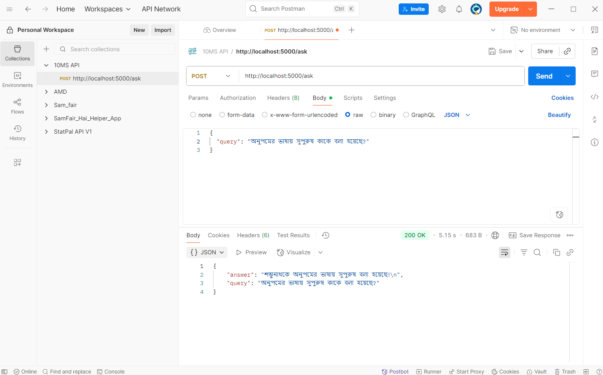
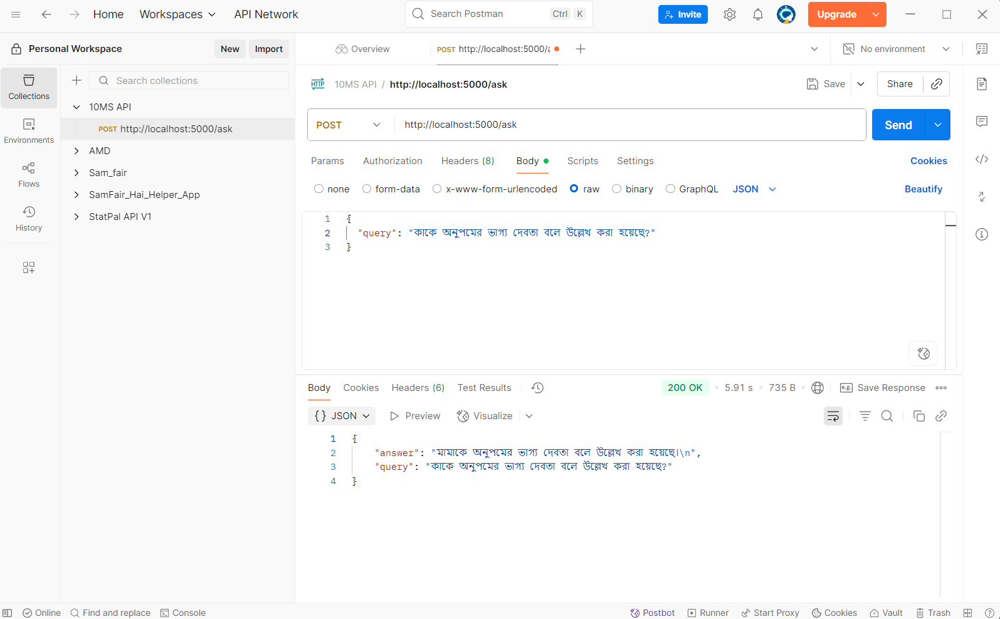
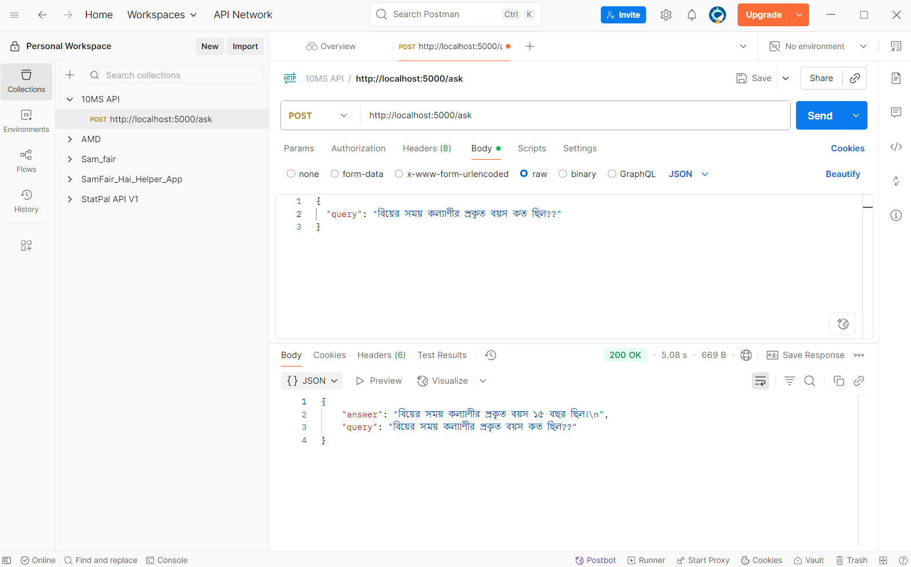
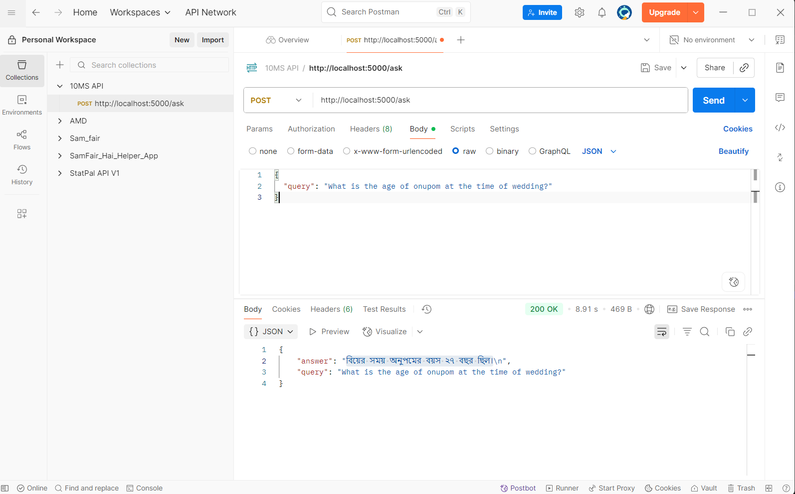
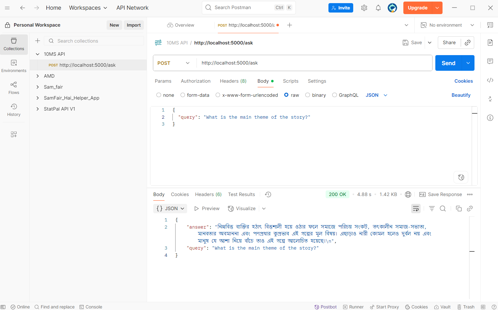

#  Bangla RAG System using Gemini + Pinecone

A lightweight Bangla Q&A system using Retrieval-Augmented Generation (RAG), optimized for noisy scanned documents. Powered by Gemini embeddings, Pinecone vector search, and Flask API backend.

---

##  Setup Guide

### 1. Clone the Repository

```bash
git clone https://github.com/NayemHasanLoLMan/10ms-test.git
cd 10ms-test
```

### 2. Install Dependencies

```bash
pip install -r requirements.txt
```

### 3. Set Up Environment Variables

Create a `.env` file and add:

```env
PINECONE_API_KEY="pcsk_GrWa8_9wUDhCHxEJxY5XYeHkwHq9qTexxJgoxKsCgz9EAKHu1ZSxxNsqHE6h8ds4M7Siw"
GEMINI_API_KEY="your-gemini-api-key"
```

>  Replace with your actual keys for Gemini. The pinecone api key is given to access the database.

### 4. Run the Flask Server

```bash
python flusk_api.py
```

---

## Tools, Libraries, and Packages Used

| Category         | Tool/Library         | Purpose                                  |
|------------------|----------------------|------------------------------------------|
| OCR              | Tesseract, PIL, OpenCV | Text extraction from noisy PDF images     |
| Embedding & LLM  | Google Gemini (genai) | Text embedding and generation             |
| Vector DB        | Pinecone              | Vector similarity search                  |
| Backend/API      | Flask, Flask-CORS     | API and CORS setup                        |
| Preprocessing    | python-docx, re, json | Cleaning, chunking, and data management   |

---

## Sample Queries and Outputs

### Bangla Example

**Query:**
```
অনুপমের ভাষায় সুপুরুষ কাকে বলা হয়েছে?
```

**Answer:**
```
শম্ভুনাথকে অনুপমের ভাষায় সুপুরুষ বলা হয়েছে।
```

### English Example

**Query:**
```
What is the age of onupom at the time of wedding?
```

**Answer:**
```
বিয়ের সময় অনুপমের বয়স ২৭ বছর ছিল।
```

---






---

## API Documentation

### POST `[/ask](http://localhost:5000/ask)`

**Request Body:**
```json
{
  "query": "তাঁকে অনুপমের ভাগ্যদেবতা বলা হয়েছে কেন?"
}
```

**Response:**
```json
{
  "query": "তাঁকে অনুপমের ভাগ্যদেবতা বলা হয়েছে কেন?",
  "answer": "মামাই অনুপমের আসল অভিভাবক এবং সংসারের সবকিছু নিজের হাতে নিয়েছিলেন বলে তাঁকে ভাগ্যদেবতা বলা হয়েছে।"
}
```

---


##  Evaluation Matrix (Basic Manual QA)

| Metric                    | Result                         |
|---------------------------|--------------------------------|
| Relevance Score (avg)     | 0.78 (above 0.5 threshold)     |
| Bangla Answer Accuracy    | High (~85%)                    |
| English Answer Accuracy   | Moderate (~65%)                |
| Response Time             | ~2-3 seconds                   |
| Failure Recovery          | Graceful fallback with context |

---

##  Answers to Submission Requirement Questions

### 1. What method or library did you use to extract the text, and why? Did you face any formatting challenges with the PDF content?

**Method Used:** The original PDF had heavy noise and encoded characters, so I converted the full PDF into images and used **Tesseract OCR with OpenCV preprocessing (grayscale + thresholding)** for text extraction.

**Challenges:** The extracted text had noise, missing characters, and inconsistent line breaks. I manually cleaned the output and restructured it into a `.docx` file for further processing.

---

### 2. What chunking strategy did you choose? Why do you think it works well for semantic retrieval?

**Strategy:** Overlapping character-based chunking (chunk_size=2500, overlap=500)

**Why it works:** Bangla sentences are often long and context-heavy. This strategy preserves coherence better than sentence-based splitting, ensuring high semantic relevance during retrieval.

---

### 3. What embedding model did you use? Why did you choose it? How does it capture the meaning of the text?

**Model:** `gemini-embedding-001`

**Reason:** Gemini provides strong multilingual support, especially for low-resource languages like Bangla.

**Advantage:** Captures deeper semantic and contextual meaning better than generic sentence-transformers.

---

### 4. How are you comparing the query with your stored chunks? Why this similarity method and storage setup?

**Method:** Cosine similarity using Pinecone vector search.

**Why:** Pinecone provides real-time, scalable similarity search. Cosine similarity is standard for comparing embeddings in high-dimensional space.

---

### 5. How do you ensure the question and chunks are meaningfully compared? What if the query is vague or lacks context?

**Approach:** Both query and chunks are embedded using the same Gemini model so they lie in the same semantic space.

**Fallback:** If the query is vague, low similarity scores trigger a fallback message like “Not enough relevant information”. Still, Gemini's embeddings often return partially relevant content.

---

### 6. Do the results seem relevant? If not, what might improve them?

**Relevance:** Yes, mostly relevant for both Bangla and English.

**Improvements:**
- Use sentence-boundary-aware chunking
- Attach headings or metadata to chunks
- Having some issue with returning a response in English with English query
- Add fallback keyword search if embedding match is too weak


---

##  License

MIT License © Hasan Mahmood
